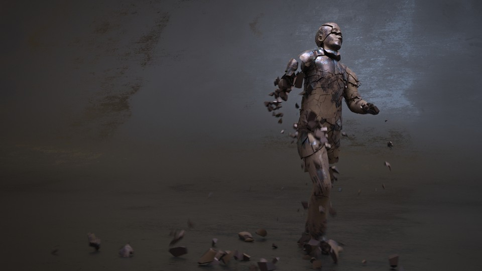

<iframe src="https://www.youtube.com/embed/9A5F7gKW3PI" 
        title="Guided" frameborder="0" allowfullscreen
        allow="accelerometer; autoplay; clipboard-write; encrypted-media; gyroscope; picture-in-picture" 
        style="position: absolute; width: 100%; height: 100%;">
</iframe>

