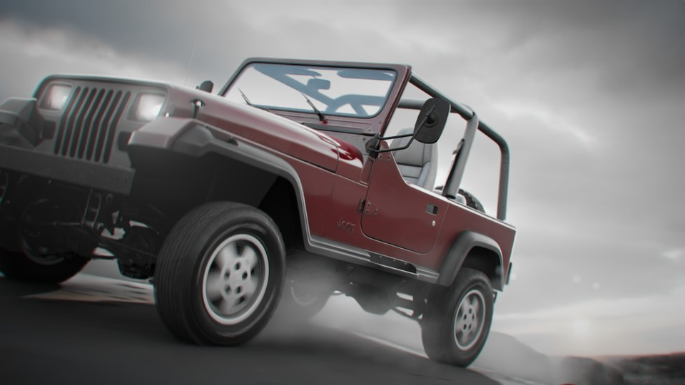
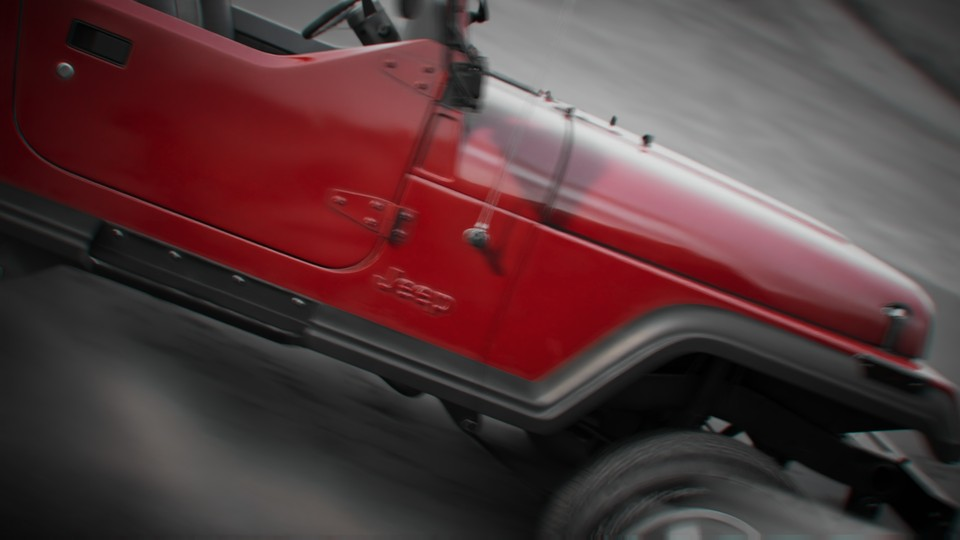
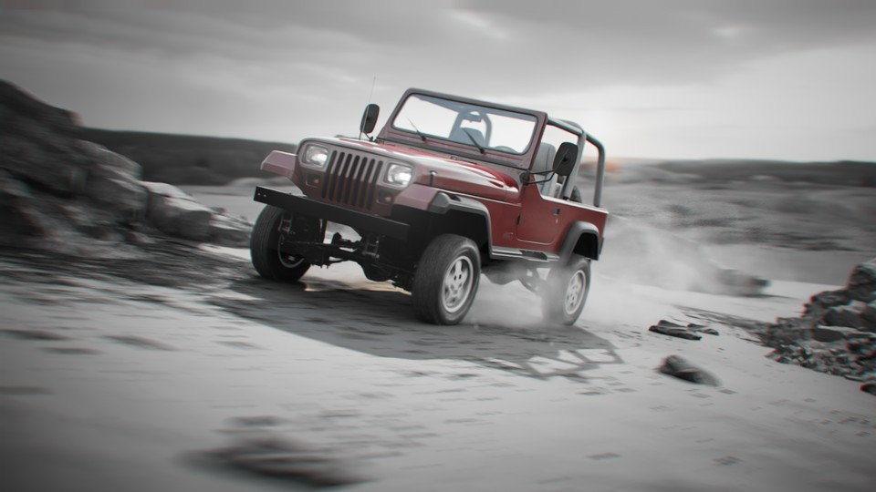

<iframe src="https://www.youtube.com/embed/MihQ7zBbvE8" 
        title="Jeep Wrangler 1987 - 01" frameborder="0" allowfullscreen
        allow="accelerometer; autoplay; clipboard-write; encrypted-media; gyroscope; picture-in-picture" 
        style="position: absolute; width: 100%; height: 100%;">
</iframe>

This project is a mix of Houdini & Unreal. The vehicle and cameras were animated in Houdini. The Dust sim was done in Houdini using the Sparse Pyro Solver and exported as VDBs to Unreal. The scene is lit by a quite lowrez HDRI, that was also used as a cheap environment. The ground is created with a Heightfield in Houdini and exported as Polygons to Unreal. The material is a Megascan material, and additional details were added using Decals. Some larger cliff and smaller rocks Megascans assets were also used. Rendered with the path tracer in unreal 5.4 with quite low settings. The edit was done in sequencer in Unreal. The final color grade was done in DaVinci Resolve.

Model: Jeep Wrangler 1987 by Luis Lara

Music: Super Collider by Six Umbrellas   
licensed under a Attribution-ShareAlike 4.0 International License

