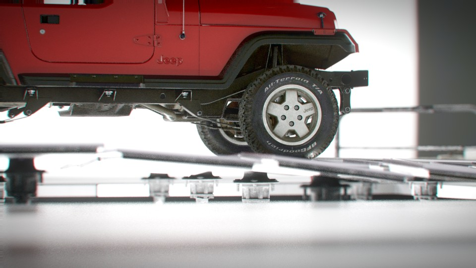
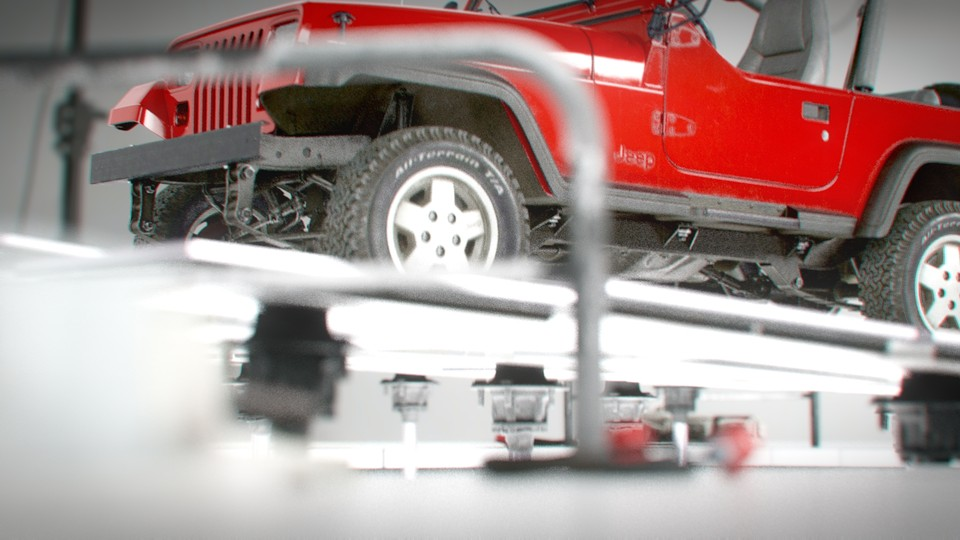
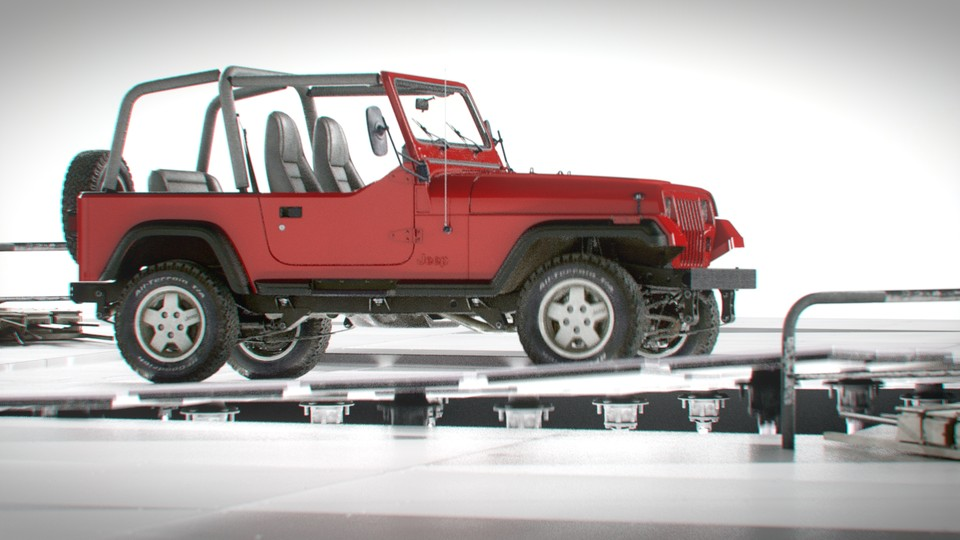
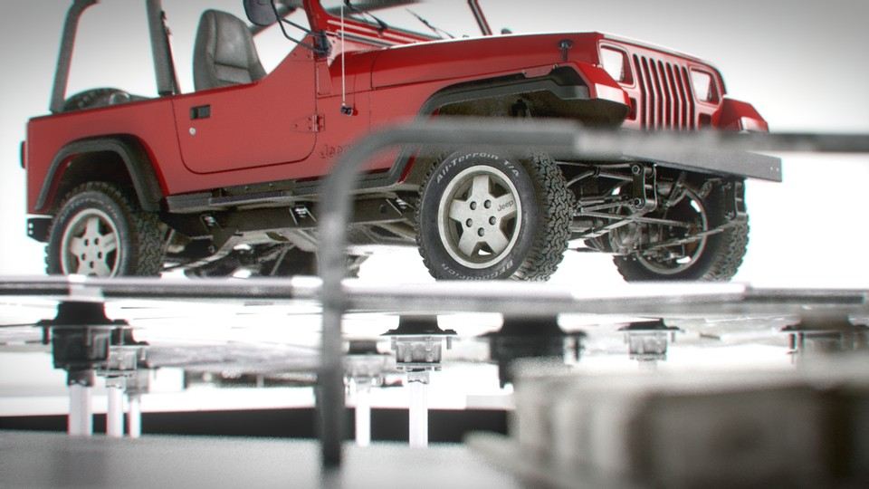

<iframe src="https://www.youtube.com/embed/FEJCTwGFEMQ" 
        title="Lego - Porsche 911 RSR - 01" frameborder="0" allowfullscreen
        allow="accelerometer; autoplay; clipboard-write; encrypted-media; gyroscope; picture-in-picture" 
        style="position: absolute; width: 100%; height: 100%;">
</iframe>

<!--  -->

This project is a mix of Houdini & Unreal. The vehicle and floor were animated in Houdini. I used Megascans for some of the props and materials. The floor were modeled in Houdini. The scene is lit by an HDRI and a directional light. Rendered with the path tracer in unreal 5.4 with 512 samples. The edit was done in sequencer in Unreal. The final color grade was done in DaVinci Resolve.

Model: Jeep Wrangler 1987 by Luis Lara

Music: Miss Japan by MegaHast3r   
Licensed under a Attribution-NonCommercial-ShareAlike License.

