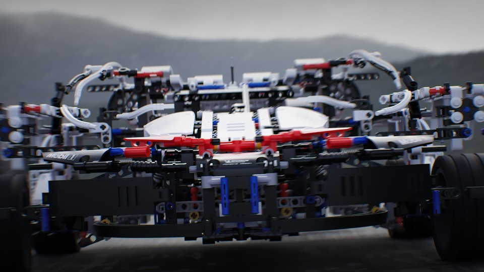
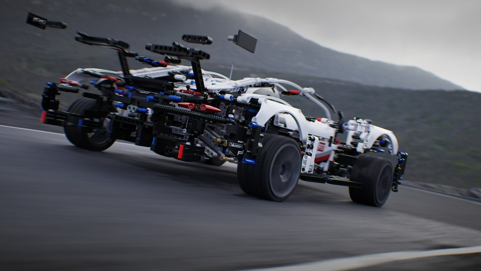
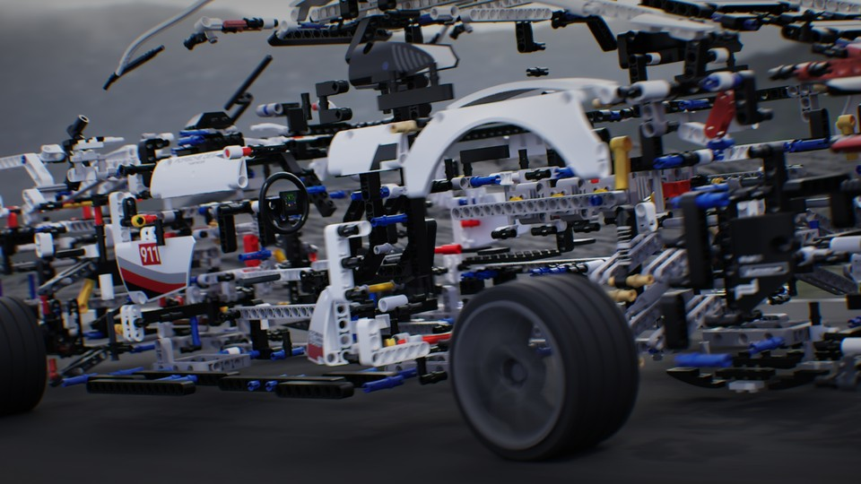

<iframe src="https://www.youtube.com/embed/viMzlwuHNis" 
        title="Lego - Porsche 911 RSR - 01" frameborder="0" allowfullscreen
        allow="accelerometer; autoplay; clipboard-write; encrypted-media; gyroscope; picture-in-picture" 
        style="position: absolute; width: 100%; height: 100%;">
</iframe>

This project is a mix of Houdini & Unreal. The aim with the project was to understand Vertex Animation Textures (VAT) well enough to be able to build a VAT export tool in Houdini. And over in Unreal, how to build a material that can use the textures to set the position of the vertices. In short VAT is a way to animate meshes on the GPU, using only textures, shaders and data stored on the mesh as vertex colors and custom uv channels. It has a much lighter performance impact on the CPU, compared to traditional skeletal mesh animations. It was great fun and I learned a ton.

The road and parts of the environment were modeled in Houdini. The vehicle and cameras were also animated in Houdini. In Unreal I used Megascans for the cliffs, decals for the road and textures for the environment materials. I did the edit in sequencer. The scene is lit by an HDRI Backdrop. It was rendered with the path tracer in unreal 5.5. The final color grade was done in DaVinci Resolve.

Lego model: Porsche 911 RSR by Stephan3321 on mecabricks.com

Music: Everywhen by Six Umbrellas   
Licensed under a Attribution-ShareAlike 4.0 International License

