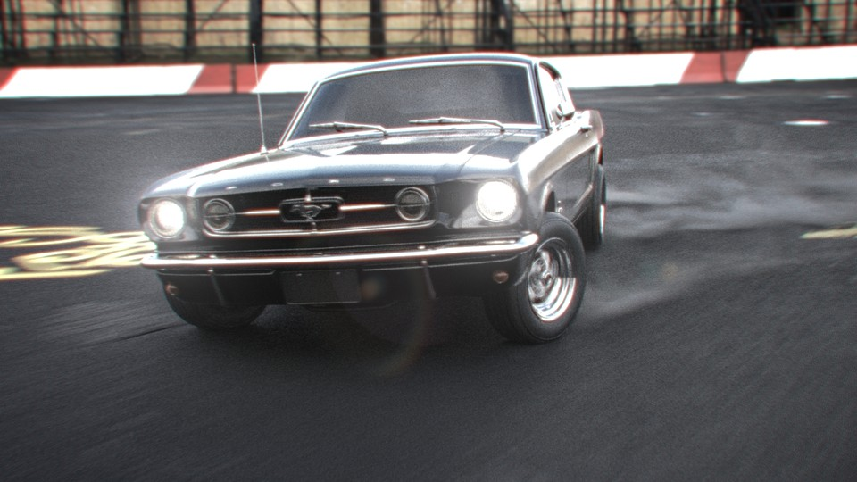
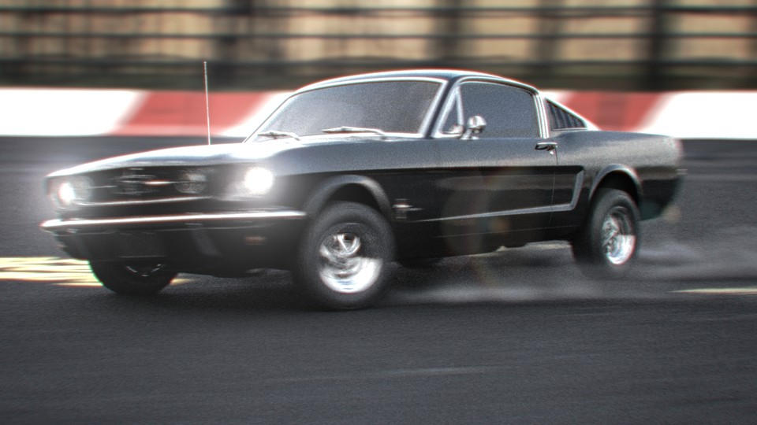

<iframe src="https://www.youtube.com/embed/3w-_ZQ6RY20" 
        title="65 Mustang Fastback - 02" frameborder="0" allowfullscreen
        allow="accelerometer; autoplay; clipboard-write; encrypted-media; gyroscope; picture-in-picture" 
        style="position: absolute; width: 100%; height: 100%;">
</iframe>

This project is a mix of Houdini & Unreal. The vehicle and cameras were animated in Houdini. The Dust sim was also done in Houdini using Axiom. The scene is lit by a quite lowrez HDRI, that was also used as a cheap environment. The ground is basically a plane with a Megascans texture and some Decals.  I did not want to do to much with the environment since the focus was on the animation workflow between Houdini and Unreal. Rendered with the path tracer in unreal 5.3 with super low settings (each frame took about 7-8 seconds). The edit was done in sequencer in Unreal, which has the nice benefit that we only need to render exactly what is needed. The final edit was done in DaVinci Resolve.

Model: 65 Ford Mustang Fastback by Luis Lara

Music: Everywhen by Six Umbrellas   
licensed under a Attribution-ShareAlike 4.0 International License

