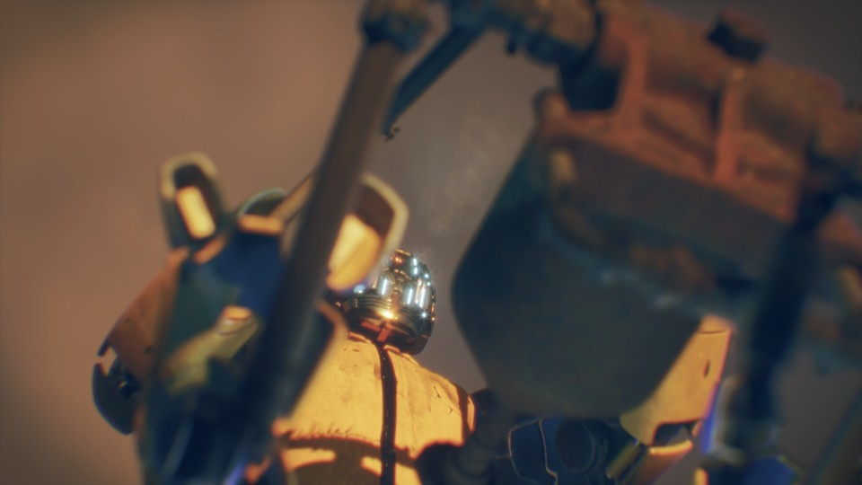
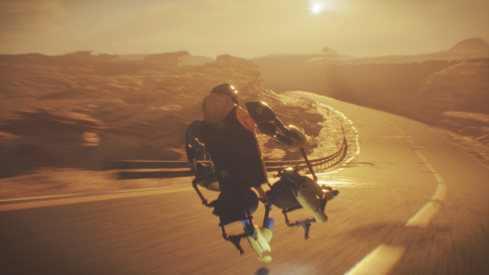

<iframe src="https://www.youtube.com/embed/7TQ9VJ7NEDM" 
        title="Pet Roadeo" frameborder="0" allowfullscreen
        allow="accelerometer; autoplay; clipboard-write; encrypted-media; gyroscope; picture-in-picture" 
        style="position: absolute; width: 100%; height: 100%;">
</iframe>

**Houdini ♥️ Unreal**

The aim with this project was to explore the workflow between Houdini and Unreal with the main focus on environment building, character & camera animation. I wanted the animation to be shaky, rough and give the feeling of speed.

I also had some software specific aims

* **Houdini**
	* *KineFX*
		* I wanted to explore rigging in KineFX (the procedural rigging toolset in Houdini)
		* More specifically I wanted to learn how to create KineFX rig HDAs
		* Explore how one rig HDA can drive another
		* Create camera HDA for more quick camera animation
	* *Scripting*
		* Write a custom exporter to export a rig HDA to Unreal sequencer
		* Write a custom exporter for camera animation to Unreal and sequencer
* **Unreal**
	* *General*
		* As I am relatively new to Unreal just starting to use it to produce animation
		* Get to know
			* Sequencer
			* Movie render queue
			* OCIO workflow
	* *Scripting*
		* Camera & object animation importer

This is a part of an ongoing personal project, so the assets are evolved over time. I test various DCCs when doing so, so a number of different apps are used.
To create this assets the following DCCs were used.

* Houdini
* Unreal
* DaVinci Resolve
* Sublime Text & Git
* Mixer (Megascans)
* Substance Designer & Painter
* Maya
* Blender
* Alias

