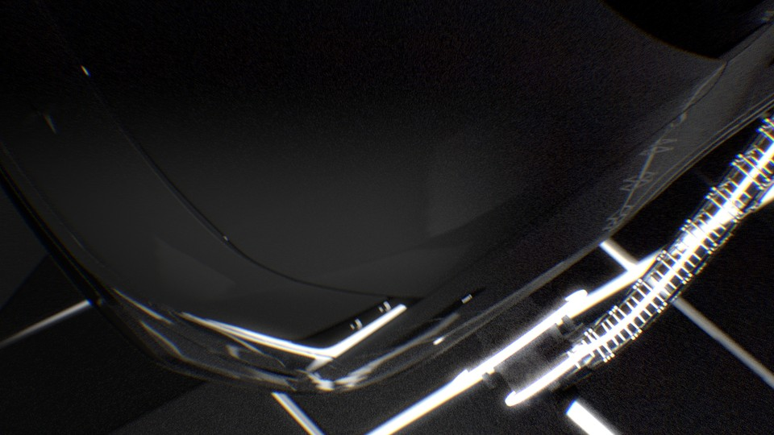
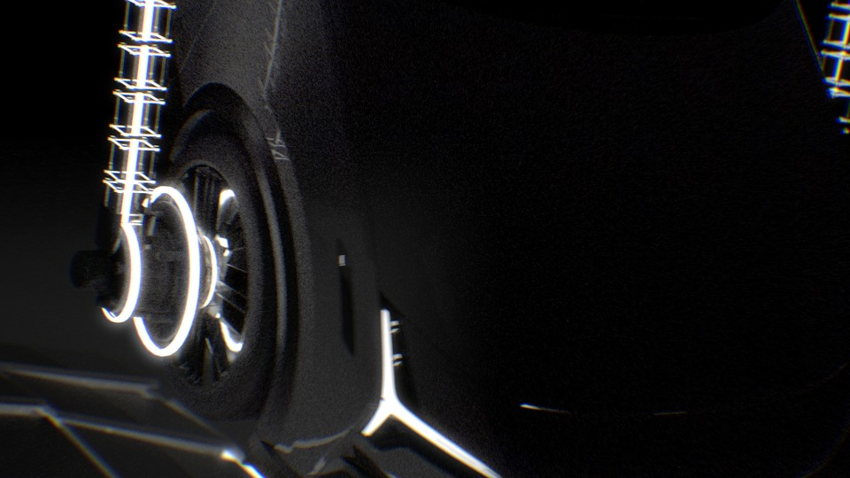
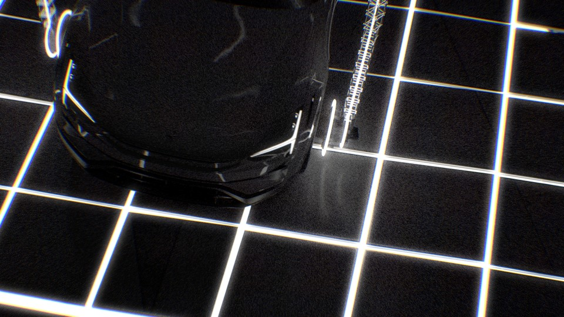
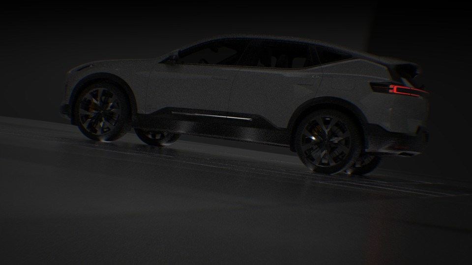
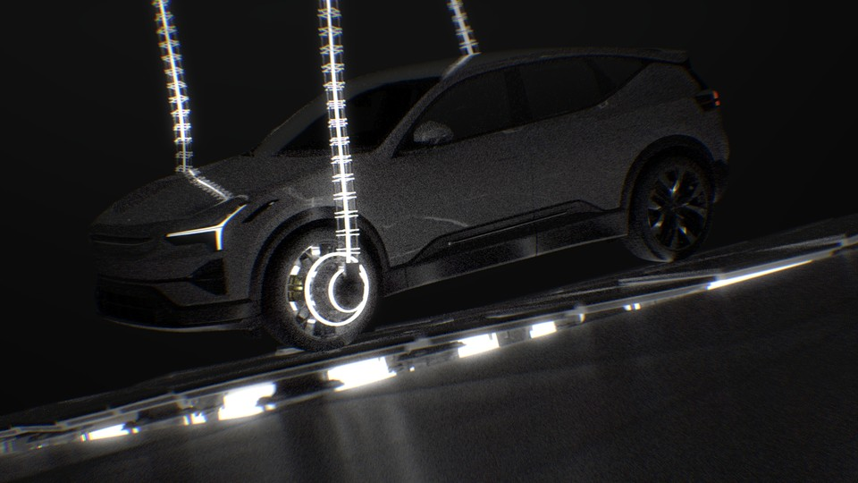
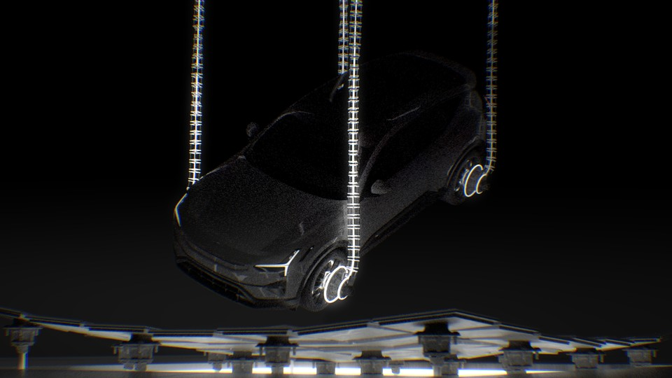

<iframe src="https://www.youtube.com/embed/1PadncAnTgE" 
        title="Polestar 3 - 04" frameborder="0" allowfullscreen
        allow="accelerometer; autoplay; clipboard-write; encrypted-media; gyroscope; picture-in-picture" 
        style="position: absolute; width: 100%; height: 100%;">
</iframe>

This project is a mix of Houdini & Unreal. The aim with the project was to explore how Vertex Animation Textures (VAT) could be used in a lighting and material workflow. In previous VAT projects I have mainly used the textures for color, position and orientation. Here I wanted to expand the material to include custom roughness, metallic and emissive properties per "piece". The roughness and metallic is not using a VAT texture, but since the mesh in Unreal is only using 1 material I wanted to export a roughness and metallic map that can vary across the "pieces" of the mesh.

The animation of cameras and objects was done in Houdini. To create the VAT textures I used the new image processing tools (COP) in Houdini, wonderful to use.

To export the animation I used 2 different custom tools. One is the VAT exporter and the other is just exporting the camera and object transforms in a .json file that I can use to set keyframes in Unreal sequencer.

The moving floor is a Copy to Points setup and the vehicle is using the RBD car rig and some constraints for the wires.

Rendered in Unreal 5.5 using pathtrace. Regarding the noise one could say that it is an artistic choice. You could also say that I have an RTX 2070 and did not want to wait.

